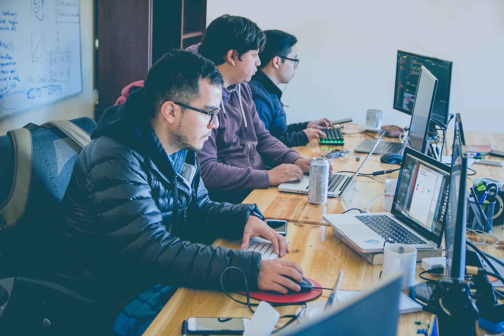

# 🟡 iOS Development

## iOS Development

Photo by [Alvaro Reyes](https://unsplash.com/@alvarordesign?utm_source=unsplash&utm_medium=referral&utm_content=creditCopyText) on [Unsplash](/?utm_source=unsplash&utm_medium=referral&utm_content=creditCopyText)

ณ ที่นี้ เป็นคอร์สที่พยายามรวบรวมและปรับปรุงเนื้อหาไปเรื่อย ๆ ในเวลาว่างสำหรับผู้สนใจที่จะพัฒนา App ที่ทำงานบน iOS ที่ใช้งานอยู่บน iPhone iPad iWatch เป็นหลัก ซึ่งก็สามารถเอาไปต่อยอดพัฒนา App ที่ทำงานบน macOS ได้ในภายหลังเช่นกัน

เนื้อหาการพัฒนา App จะเน้นไปที่ภาษา Swift 4 เป็นหลัก  นอกจากภาษาที่ใช้ในการพัฒนาแล้วต้องรู้ด้วยว่าชิ้นส่วนหรือองค์ประกอบ Component พื้นฐาน\(Kit\)ที่มีมาให้มีอะไรบ้าง เอาไว้ใช้งานอย่างไรและมีวิธีใช้งาน Implementation อย่างไรบ้างเพื่อให้ Component ทำงานได้ถูกต้อง รวมไปถึงการนำแอพขึ้น App Store Market ให้ผู้ใช้ดาวน์โหลดมาติดตั้งใช้งานได้ต่อไป

มีข้อเสนอแนะให้ปรับปรุงเนื้อหาส่วนไหนก็ติดต่อ...\(ไว้ซักพักเดียวมาเพิ่มเติม\)...ได้เลยครับ

